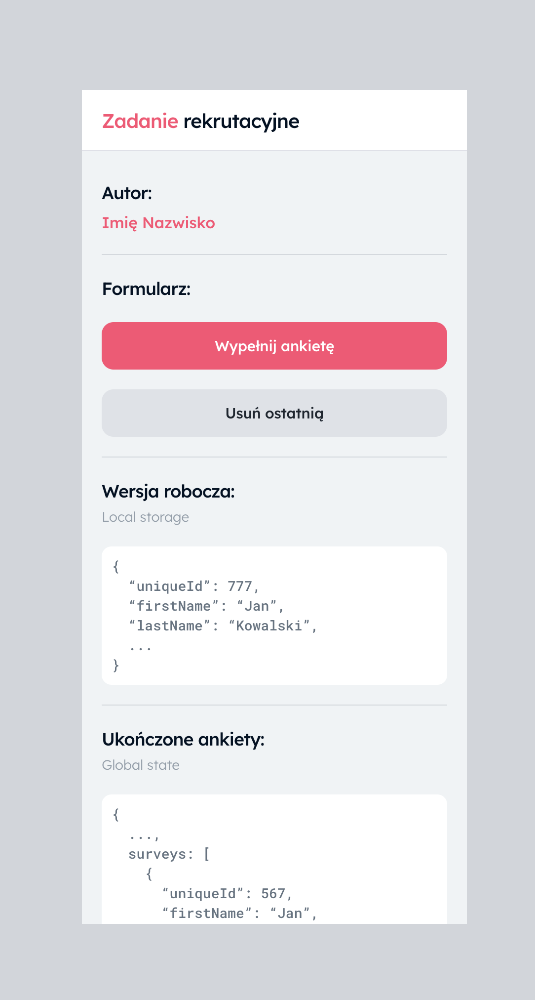
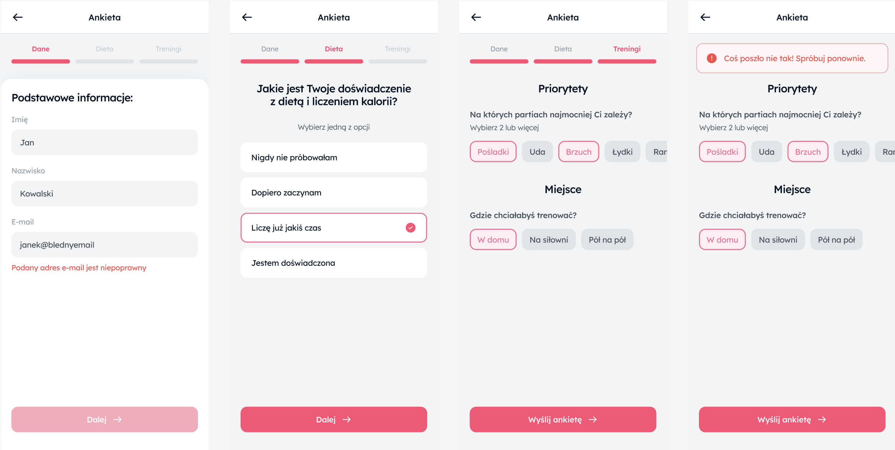

# Zadanie rekrutacyjne

Stworzenie wieloetapowego formularza zgłoszeniowego mobile-first, zbierającego dane osobowe oraz preferencje dietetyczne i treningowe.

## Przygotowanie

Projekt już posiada zaimplementowany główny layout, routing, tailwindcss, kolory i fonty użyte w Figmie, przykładowe komponenty oraz symulację API.

{: width=300px }

## Instalacja

```bash
yarn install
```

## Uruchomienie

```bash
yarn dev
```

## Figma

[Link do projektu](https://www.figma.com/design/N20jQ9L7wxmzXCAK2a7w7V/React-Dev---UX%2FUI%3A-Ankieta?node-id=13-197&t=tZwRmwqOFEcCZk3J-0)

## Wymagania

#### Funkcjonalne:

- Formularz składający się z 3 kroków.
- Walidacja każdego kroku, przed przejściem do następnego.
- Przechowywanie stanu formularza i zachowanie wersji roboczej w local storage.
- Przycisk w głównym widoku umożliwiający przejście do nowej ankiety lub wersji roboczej, jeśli nie została wysłana lub strona została odświeżona w trakcie wypełniania.
- Wyświetlanie wersji roboczej zapisanej w głównym widoku aplikacji.
- Historia wysłanych z sukcesem ankiet w global state, wyświetlana w głównym widoku aplikacji.
- Przycisk umożliwiający usunięcie ostatniej ankiety dodanej do global state.

#### UX/UI:

- Precyzyjne odwzorowanie projektu z dostarczonej Figmy.
- Użycie Flexbox do tworzenia layoutów.
- Płynne animacje przejść pomiędzy krokami.
- Toast obsługujący sukces i błędy API.
- Tylko wersja mobilna.

#### Techniczne:

- React.js
- React Router
- React Query lub RTK Query
- Tailwind CSS
- TypeScript
- Shadcn/ui
- Symulacja API z wykorzystaniem mockApi.ts

## Oceniane aspekty

- Czystość i organizacja kodu.
- Precyzyjność odwzorowania projektu z Figmy.
- Skuteczność implementacji funkcjonalności i animacji.
- Zrozumienie i zastosowanie nowoczesnych praktyk w React.js.
- Umiejętność zarządzania stanem aplikacji.
- Efektywne wykorzystanie Flexboxa i Tailwind CSS.
- Wykorzystanie shadcn/ui.

## Docelowy UI aplikacji

{: width=1300px }
